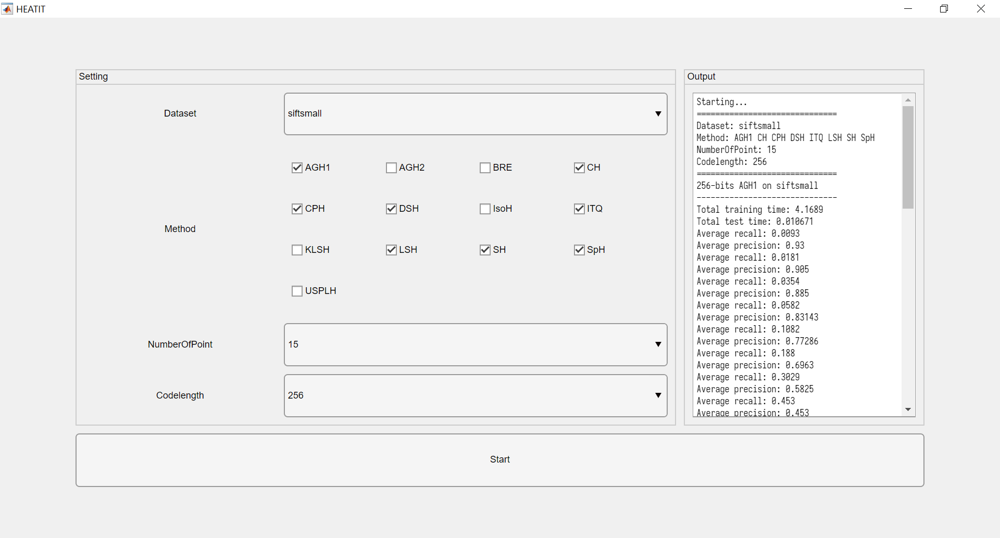
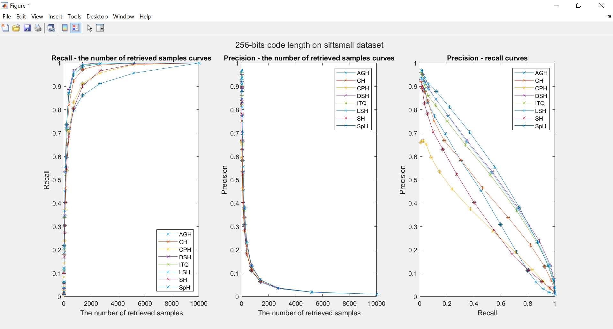

# heatit

HEATIT - Hash EvAluation ToolkIT

## Screenshots

<p align="center"></p>

<p align="center"></p>

## Hashing method interface

```matlab
% Offline training
function [model, train_coded, train_time] = method_learn(trainset, codelength)

% Online search (encoding only)
function [test_coded, test_time] = method_compress(testset, model)
```

## Datasets

[SIFT10K, SIFT1M and GIST1M](http://corpus-texmex.irisa.fr/)
